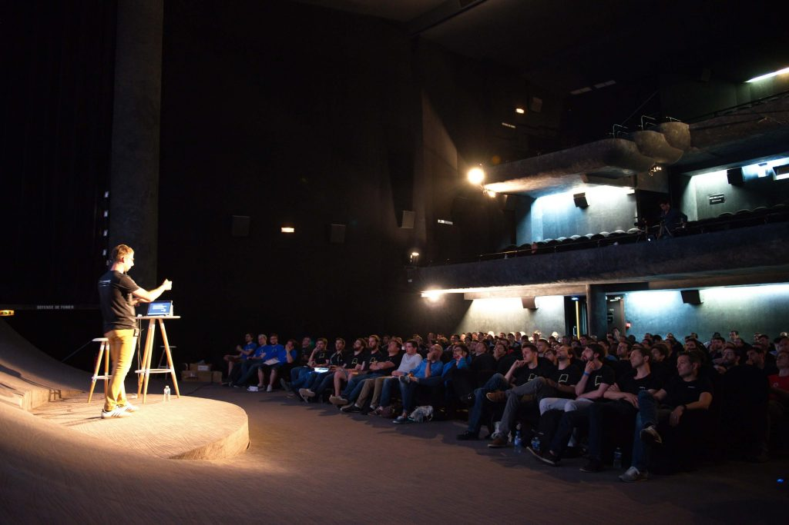
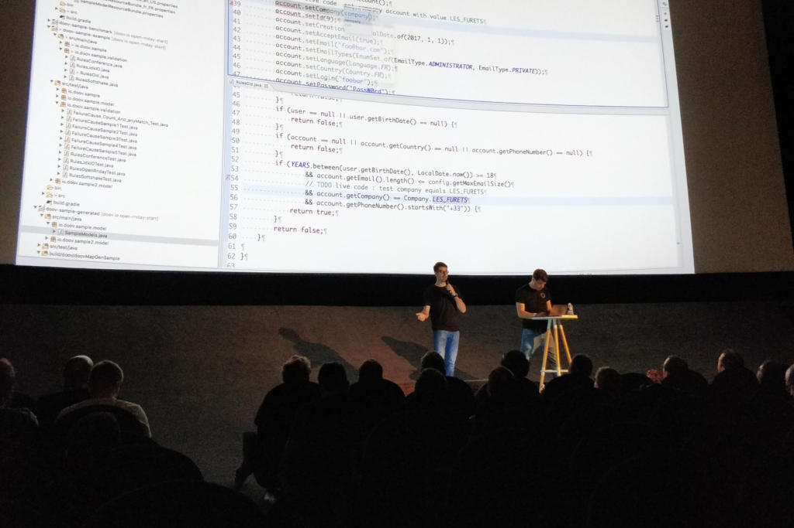

# Conferences

Conference speaker since 2014, I've talked about subjects like [Continuous Delivery](#continuous-merge-with-git-octopus), [Apache Spark](#apache-spark-for-java-developers), [Domain Object Oriented Validation](#domain-object-oriented-validation-doov), [AI Music Generation using Magenta and Tensorflow](#ai-music-generation-using-magenta-and-tensorflow), software craftsmanship, software factory and other subjects, in many conferences, universities (Telecom Paris Tech, Rouen University, INSTA Paris), JUG (Java User Groups), BBL (Brown Bag Lunch), and meetups, in France and internationally.

## Main conferences

### [Music Generation with Magenta: Using Machine Learning in Arts](music-generation-with-magenta)

Composing music is hard and the lack of inspiration can be daunting. A lot of elements are required to make it work: musical score, instruments, musicality, feeling, groove, originality. Music generation has been around for ages, even before the digital era, as a tool for musician to create new music and get inspired. What about machine learning? Can we use it as a tool for music generation? With Magenta, a music generation library based on Tensorflow, you can use the power of machine learning to help musical creation. In this presentation, we'll see why specific neural networks, such as RNN, LSTM and VAE, have specific usage in music generation. We'll then live code a small music generation application using Magenta. Finally, we'll see how to train a model on your own style, used to then generate new rhythms, melodies and audio clips.

### [Deploying your application secrets with Hashicorp Vault](secrets-with-hashicorp-vault)

Managing application secrets, like database credentials, passphrases, salts and private keys, is hard. The availability of those elements are critical to the application, yet they need to be properly secured to reduce the attack surface on your system. Most secret management systems, like Hashicorp Vault, are used as a centralized database, but it creates a single point of failure and it requires extra care in hardening the security of that system. How about deploying your secrets, in Hashicorp Vault, alongside your application? By leveraging your build infrastructure, you can deploy a copy of your secrets, in a Vault that is secured using a one-time token, accessible only by your application. In this presentation, we'll show a continuous delivery pipeline that enables that approach, talk about the implications of handling secrets in your build infrastructure, and use threat modeling to verify the security of the deployed Vault.

### [Domain Object Oriented Validation (dOOv)](domain-object-oriented-validation-doov)

Fluent, stream-like API are great for writing type checked code, taking advantage of Java 8 functions and lambdas. What about creating your own fluent API to manipulate and validate your model? We created an framework called dOOv, for "Domain Object Oriented Validation", that generates a validation DSL from a domain model. This presentation will demonstrate the efficiency and expressiveness of dOOv to define validation constraints. The validation rules are represented as an abstract syntax tree, which makes it possible to visit the tree and show the rule in text format, markdown, or HTML. We will compare our solution to industry standards like Bean Validation. During the session, we will live code legacy business rule migration to dOOv.

### [Apache Spark for Java Developers](apache-spark-for-java-developers)

Apache Spark proposes a Java API as a first class citizen, but is it as powerful as the Scala API? Does it use every feature of the language, such as lambdas? Does it integrate properly with our unit test tooling and existing Java code base? We will dive into the Spark Java API through examples and live coding from our code base, by covering the basic usage and dependency management, unit testing with JUnit, launching from an IDE and integrating Spark code with our existing Java code base. Since Spark version 2.0, the unified DataFrame API makes Spark easier to use and faster to execute in Java, but there is still little documentation on specific use cases, and many syntax quirks make Scala code difficult to convert to Java. The slides and live coding will present the good, the bad and the ugly moments our Java development team encountered while using Spark.

### [Continuous Merge with git-octopus](continuous-merge-git-octopus)

This presentation tackles the subject of continuous delivery with tangible solutions, that covers code versioning, handling of multiple parallel developments and deployment of artifacts. The concept of "continuous merge", made possible by the open-source tool git-octopus developed at LesFurets.com, is the most important part of our continuous delivery process. Continuous merge is a process that emerged from 2 years of daily delivery and enables the early detection of merge problems between branches. It is therefore possible to push to production everyday without sacrificing quality and without adding a burden on our development process.

## Older

### [AI Music Generation using Magenta and Tensorflow](ai-music-generation)

Overview of some AI music generation tools. We'll talk about music generation in general, real world examples, wavenet for voice, magenta for music, AI theory and state of the art.

### [Code Review](code-review)

Overview of our code review process based on a `git flow` branching strategy that does not require any tool.

## [Ximista Live Video Generation from Sound](ximista-live-video-generation-from-sound)

Generating video from sound with touch designer during live concerts.

## Classes

### [Git Version Control](git-gestion-version)

Master class about git and version control systems.
